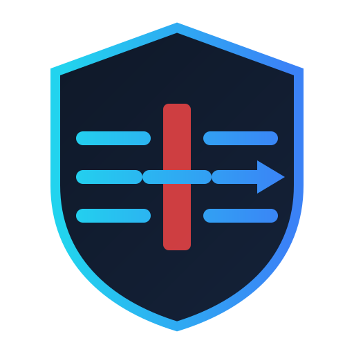

<div align="center">
  
  <h1>DPI-Bypass</h1>
  <p><strong>Domain bazlı, profil destekli DPI atlatma uygulaması.</strong><br/>
  Domain-based, profile-aware anti-censorship app — stable access to DPI-blocked platforms (e.g. Discord).</p>
</div>

---

> **Durum — Çapraz platform (Linux + Windows).** Linux'ta zapret/`nfqws` motoru, Windows'ta WinDivert/GoodbyeDPI motoru ile çalışır. Profiller, ağ parmak izi, sessiz arka plan testi, ağ değişimi algılama, gelişmiş strateji düzenleyici, tema/dil ve "Her Zaman Açık" (Linux: systemd, Windows: zamanlanmış görev) tamamlanmıştır. Her iki platform için sürümler GitHub Actions tarafından otomatik (artan numara: v1, v2, …) yayınlanır.

## Hızlı Kurulum

Her iki komut da **en son sürümü** indirip kurar.

**Linux** (terminal):

```bash
curl -fsSL https://raw.githubusercontent.com/ATOMGAMERAGA/DPI-Bypass/main/install.sh | sudo bash
```

**Windows** (yönetici PowerShell):

```powershell
irm https://raw.githubusercontent.com/ATOMGAMERAGA/DPI-Bypass/main/install.ps1 | iex
```

> Windows betiği yönetici değilseniz kendini UAC ile yükseltir (WinDivert sürücüsü yönetici hakkı gerektirir). Linux betiği dağıtımınızı otomatik tanır (apt / dnf / pacman / zypper / xbps / apk), bağımlılıkları kurar ve en son release arşivini yerleştirir.
>
> **Güvenlik:** Bir betiği `| sudo bash` / `| iex` ile çalıştırmadan önce inceleyin. Sürüm arşivlerinin yanında SHA256 sağlama toplamları yayınlanır.

## Ne yapar?

Bir alan adına (öncelikle **Discord**) ISS'nizin DPI'ı yüzünden erişemiyorsanız, DPI-Bypass yerel cihazınızda paket manipülasyonu yaparak erişimi geri kazandırır:

- **Erişilebilirlik ön kontrolü** — engel yoksa hiçbir şey yapmaz.
- **Otomatik strateji bulucu** — çalışan atlatma ayarını sizin için dener ve bulur.
- **Profil** — bulunan ayar, bağlı olduğunuz ağa bağlanarak kaydedilir; ağ değişirse uyarır.
- **Discord metin + ses** — TCP (metin/API) ve UDP/QUIC (ses) ayrı ayrı ele alınır.
- **Her Zaman Açık** — `systemd` ile açılışta otomatik.
- **Tam geri alınabilir** — tüm nftables kuralları izlenir; tek tıkla temizlenir (kill-switch).
- **Gizlilik** — telemetri yok, trafik içeriği okunmaz/kaydedilmez.

## Mimari

| Katman | Crate / dizin | Yetki | Sorumluluk |
|---|---|---|---|
| GUI | `src-tauri` + `src/` (Tauri, Vanilla TS) | yetkisiz | Arayüz, komut köprüleri, tray |
| Çekirdek | `crates/dpi-core` | yetkisiz | Strateji, profil, erişilebilirlik probu, strateji bulucu |
| Helper | `crates/dpi-helper` | **yetkili** | Linux: nftables + `nfqws` + systemd · Windows: GoodbyeDPI + zamanlanmış görev |
| Motor | `nfqws` (zapret) · GoodbyeDPI + WinDivert | yetkili | Paket manipülasyonu |

GUI asla doğrudan yetkili çalışmaz; yetkili işlemler küçük, denetlenebilir `dpi-bypass-helper`'a devredilir. Linux'ta `pkexec` + bir polkit kuralı (`AUTH_ADMIN_KEEP`) parolanın oturum boyunca bir kez sorulmasını sağlar; Windows'ta GUI `requireAdministrator` ile yükseltilir ve helper'ı doğrudan çağırır.

## Kurulum (Linux)

```bash
curl -fsSL https://raw.githubusercontent.com/ATOMGAMERAGA/DPI-Bypass/main/install.sh | sudo bash
```

> **Güvenlik:** `curl | sudo bash` çalıştırmadan önce betiği inceleyin ve (yayınlandığında) SHA256/GPG imzasını doğrulayın.

Betik dağıtımınızı `/etc/os-release` üzerinden tanır (apt / dnf / pacman / zypper / xbps / apk), bağımlılıkları kurar, GUI + helper + `nfqws` motorunu yerleştirir, masaüstü girdisini ve polkit kuralını ekler, systemd servisini **kapalı** bırakır.

> Hazır paket için [Releases](https://github.com/ATOMGAMERAGA/DPI-Bypass/releases) sayfasından en son `dpi-bypass-vN-linux-x86_64.tar.gz` arşivini indirin, açın ve `sudo ./install.sh` çalıştırın.

## Kurulum (Windows)

[Releases](https://github.com/ATOMGAMERAGA/DPI-Bypass/releases) sayfasından en son `dpi-bypass-vN-windows-x86_64.zip` arşivini indirin, açın ve yönetici PowerShell'de:

```powershell
.\install.ps1
```

Arşiv GUI'yi, helper'ı ve GoodbyeDPI + WinDivert motorunu içerir. Uygulama yönetici hakkı ister (WinDivert sürücüsü için). "Her Zaman Açık", uygulama içinden bir zamanlanmış görev olarak ayarlanır.

## Sürümler ve CI/CD

`main`'e her push'ta GitHub Actions Linux ve Windows üzerinde tüm testleri (fmt + clippy + birim testleri) çalıştırır; hepsi geçerse otomatik olarak bir sonraki numarayla (v1, v2, v3, …) hem Linux hem Windows arşivlerini SHA256 sağlama toplamlarıyla birlikte yayınlar. PR'larda yalnızca test matrisi (`ci.yml`) çalışır.

## Kaynaktan derleme

```bash
# 1. Marka varlıkları (logo.svg → ikon seti)
./scripts/gen-assets.sh

# 2. DPI motoru (zapret nfqws) — bundle edilir
#    Debian/Ubuntu derleme bağımlılıkları:
sudo apt-get install -y libnetfilter-queue-dev libnfnetlink-dev libmnl-dev libcap-dev zlib1g-dev
./scripts/build-engines.sh

# 3. Frontend
npm install && npm run build

# 4. Backend (release)
cargo build --release

# 5. Kur
sudo ./install.sh
```

Geliştirme modu (hot-reload):

```bash
npm install
cargo install tauri-cli --version '^2'
cargo tauri dev
```

## Doğrulama / test

```bash
cargo test --workspace          # birim testleri (core + helper)
cargo clippy --workspace --all-targets -- -D warnings
cargo fmt --all -- --check

# Helper'ın üreteceği nftables + nfqws komutunu (root'suz) görün:
cargo run -p dpi-helper -- plan \
  --strategy '{"tcp":{"desync":"fake,split2","split_pos":"midsld","ttl":0,"fooling":"md5sig","repeats":1}}' \
  --domains discord.com,discord.gg
```

## SSS

**Metin açıldı ama ses çalışmıyor.**
Discord sesi UDP/QUIC üzerinden çalışır ve ayrı bir atlatma gerektirir. DPI-Bypass sesi ayrıca test eder ve UDP profili uygular; yine de bazı ağlarda ses TCP'den daha zordur. Profilinizi yeniden bulmayı (yeni strateji ara) deneyin.

**Profilim bir gün çalışıp ertesi gün çalışmadı.**
Strateji, bulunduğunuz ağın DPI kutusuna bağlıdır. İnternete bağlanma yönteminiz (modem, ISS, hotspot) değişirse uygulama uyarır ve yeni profil arar. ISS DPI kurallarını da güncelleyebilir.

## Sorumlu kullanım

Bu araç, meşru ama engellenmiş platformlara erişimi yeniden sağlamak içindir. Bulunduğunuz yargı bölgesinin yasalarına uymak sizin sorumluluğunuzdadır. Uygulama veri toplamaz ve telemetri göndermez.

## Lisans

DPI-Bypass, [GPLv3](LICENSE) ile lisanslanmıştır. Bundle edilen motorlar kendi lisanslarına tabidir: [zapret](https://github.com/bol-van/zapret), [GoodbyeDPI](https://github.com/ValdikSS/GoodbyeDPI).
